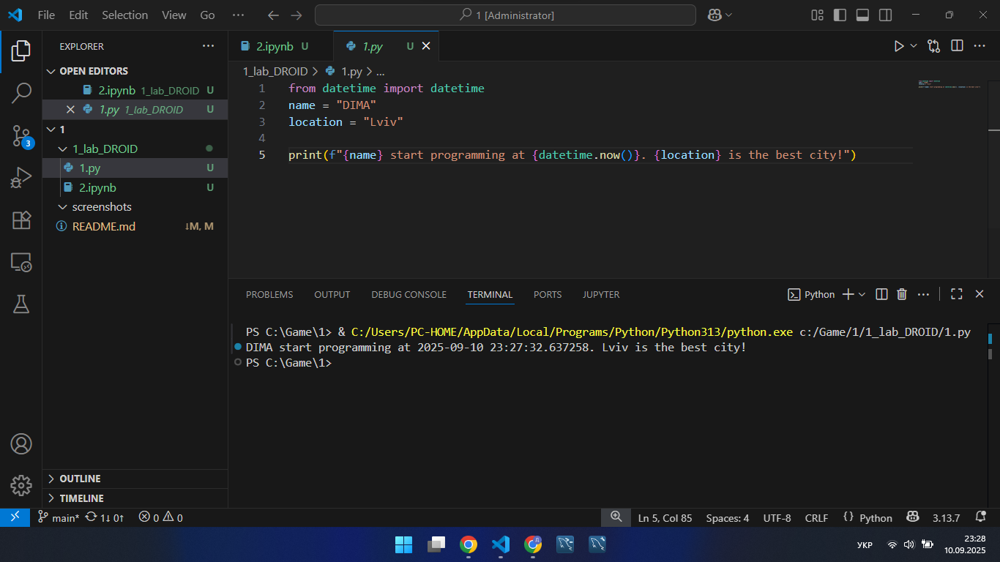
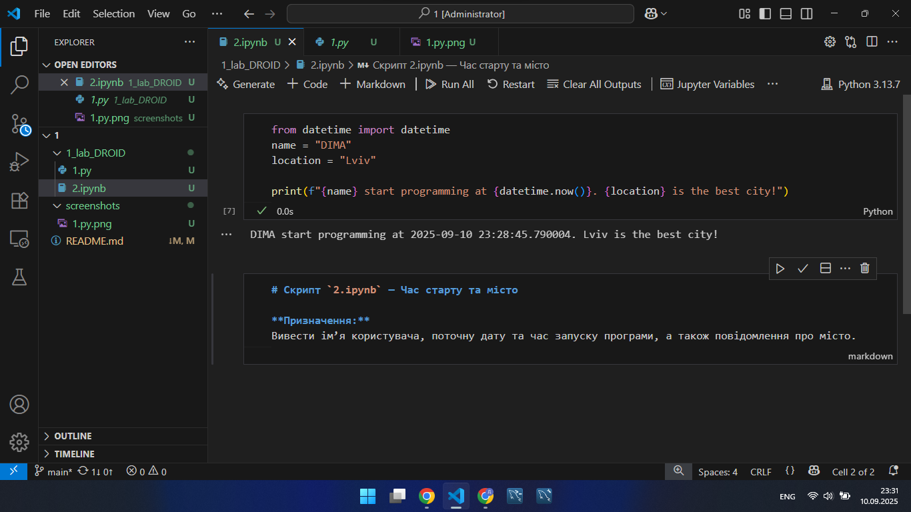
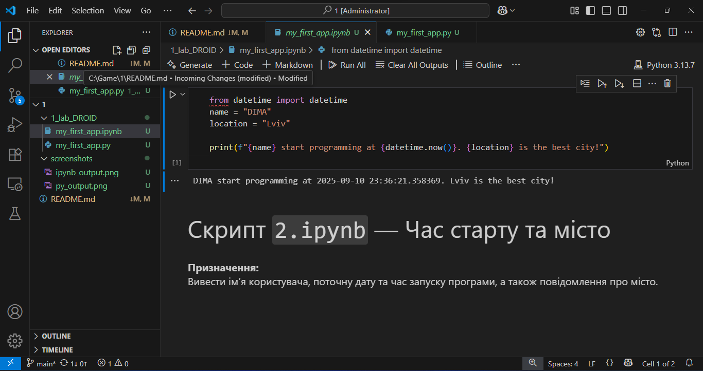
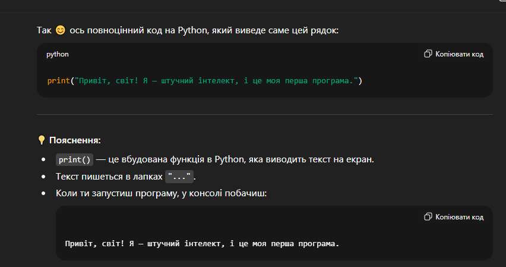

# Звіт до роботи

## Тема:
Моя перша програма на Python

## Мета роботи:
Ознайомитися з основами програмування на Python, навчитися запускати програми у Visual Studio Code , оформлювати результати у вигляді звіту з використанням Markdown.

## Виконання роботи
Створив заготовку для звіту та перші файли Python для написання програм.
Встановив необхідні плагіни та почав роботу в VS code.
Запитав в AI про першу програграму.

### Результати виконання завдання
Розроблено Python-програму, яка виводить ім’я, поточний час та улюблене місто.
Програма вивела значення:

## Відповідь від AI: перша програма і пояснення
python
print("Привіт, світ! Я — штучний інтелект, і це моя перша програма.")

## Висновок:

Що зроблено в роботі: Створено та запущено першу програму на Python у VS Code та Jupyter Notebook, оформлено звіт з кодом, результатами та скріншотами.

Чи досягнуто мети роботи: Так, мета досягнута.

Які нові знання отримано: Ознайомився з основами Python, роботою з VS Code, Jupyter Notebook та Markdown.

Чи вдалось відповісти на всі питання: Так.

Чи вдалося виконати всі завдання: Здається що так.

Чи виникли складності: Невеликі труднощі із вставкою скріншотів у README.

Чи подобається такий формат здачі роботи: 
Так, зручно але потрібно привикнути і ще багато чого навчитись.