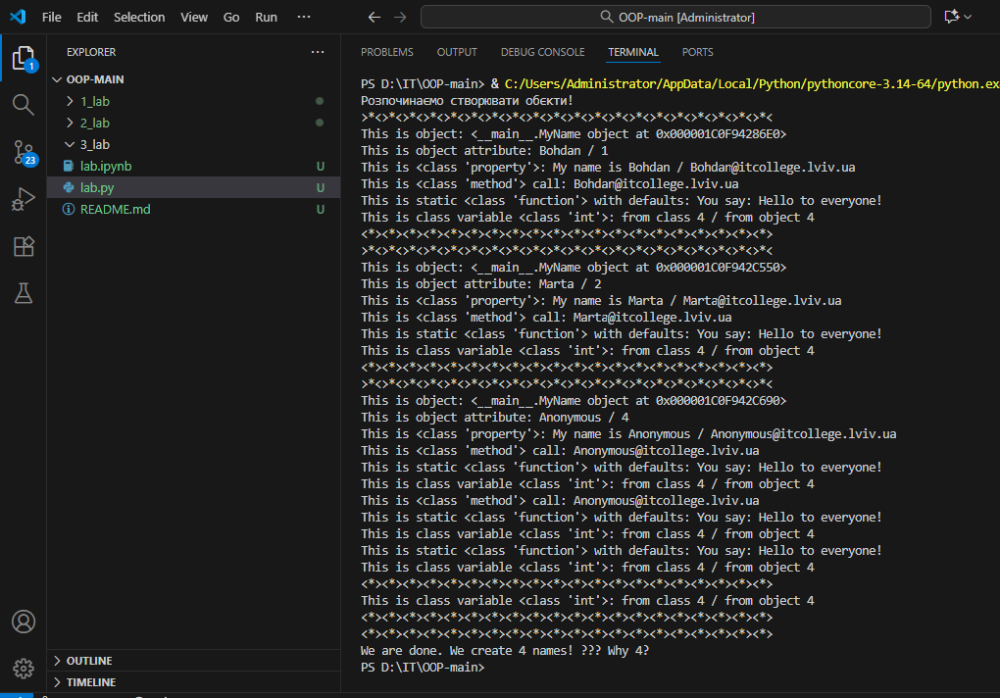
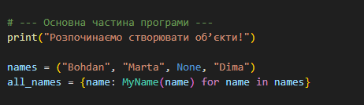
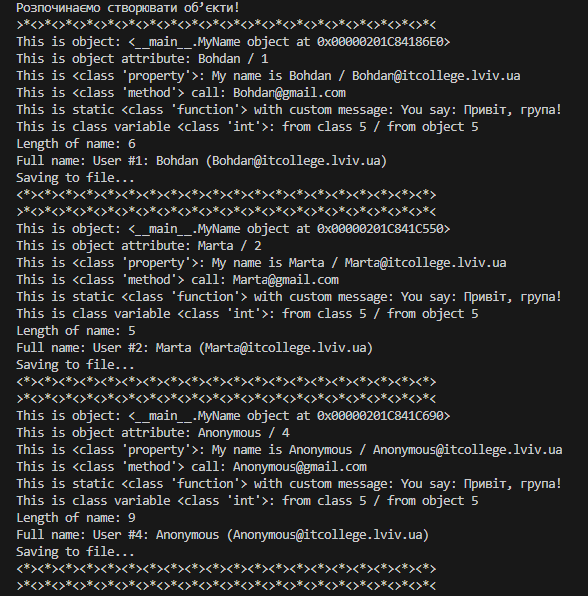
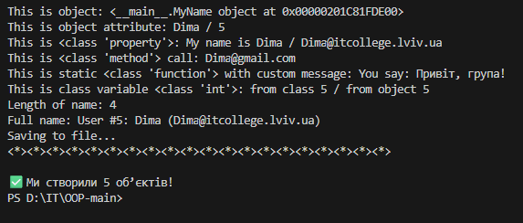
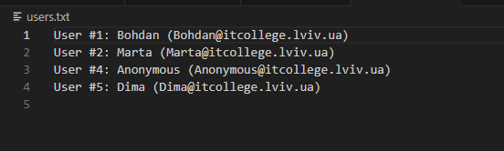

## Звіт до роботи №3 
# Тема: Знайомство з ООП
# Мета роботи: 
### Навчитись використовувати основні принципи ООП, розглянути кострукції побудови класу та створення обєктів та навчитись працювати з ними

## Запустив програму ось що вона вивела:

## Модифікував програму додавши своє імя в список

## модифікував конструктор init

#### щоб значення self.name завжди починалося з великої літери, навіть якщо користувач ввів маленьку
#### змінінив метод create_email так щоб можна було модифікувати значення після @;
#### додав перевірку: якщо ім’я містить цифри або символи, підніміть помилку
#### ValueError("Ім'я може містити лише літери!").
#### додав нову властивість full_name, яка повертає результат у форматі: "User #<id>: <name> (<email>)"
#### реалізував метод save_to_file(filename="users.txt"), який додає рядок із записом у файл;

## Запустив програму і ось що вона вивела

#  Таблиця методів класу `MyName`

| Метод      | Тип           | Опис                                                       | Приклад використання                  |
|-------------------------|---------------|-------------------------------------------------------------|---------------------------------------|
| `__init__`              | instance      | Ініціалізує об'єкт, перевіряє ім'я, капіталізує             | `MyName("Dima")`                      |
| `whoami`                | property      | Повертає ім'я                                               | `obj.whoami`                          |
| `my_email`              | property      | Повертає email                                              | `obj.my_email`                        |
| `create_email(domain)`  | instance      | Створює email з заданим доменом                             | `obj.create_email("gmail.com")`       |
| `name_length()`         | instance      | Рахує кількість букв у імені                                | `obj.name_length()`                   |
| `full_name`             | property      | Форматований рядок з ім'ям та email                         | `obj.full_name`                       |
| `anonymous_user()`      | classmethod   | Створює об'єкт з ім'ям "Anonymous"                          | `MyName.anonymous_user()`             |
| `say_hello(msg)`        | staticmethod  | Повертає привітання                                         | `MyName.say_hello("Привіт!")`         |
| `save_to_file()`        | instance      | Записує дані у файл                                         | `obj.save_to_file()`                  |

### Відповіді на запитання:
1) Чому при None створюється Anonymous?    

    Метод __init__ викликає self.anonymous_user().name, якщо ім’я не передано.

2) Як змінити текст привітання?

    Викликати say_hello("Ваш текст"), наприклад: say_hello("Привіт, група!").

3) Як порахувати кількість букв у імені?

    Метод name_length() використовує len(self.name).

4) Чому кількість імен ≠ кількість об’єктів?

    У списку names є None, який створює окремий об’єкт з ім’ям "Anonymous". Тому кількість створених об’єктів дорівнює кількості елементів у списку, навіть якщо деякі імена замінюються.

##  Висновок
У цій лабораторній я навчився створювати класи, працювати з атрибутами, методами, властивостями, обробляти помилки та зберігати дані у файл.  
ООП дозволяє структурувати код, робити його гнучким і масштабованим.
