# Лабораторна робота №6  
**Тема:** Робота з віртуальними середовищами.

**Мета роботи:**
Ознайомитися з інструментами управління пакетами в Python (pip), навчитися створювати ізольовані віртуальні середовища за допомогою venv, pipenv та poetry, а також здобути практичні навички роботи зі сторонніми API за допомогою бібліотек requests, jikanpy та мікрофреймворку Flask.

# Хід роботи

## Основи роботи з сторонніми бібліотеками 
- 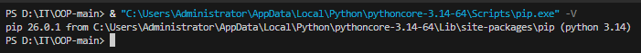
- 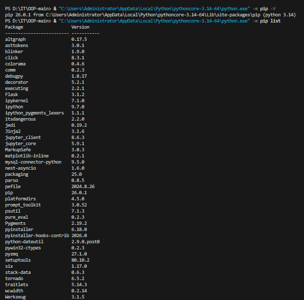
- 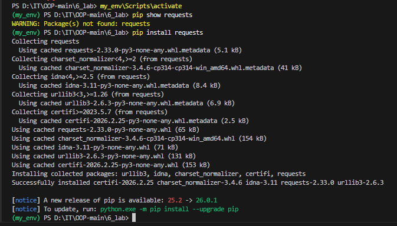
- 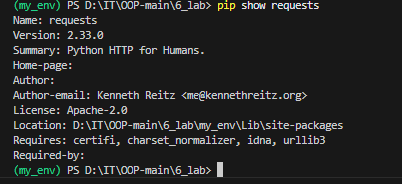---

## Код Python-скрипту `anime.py`.  
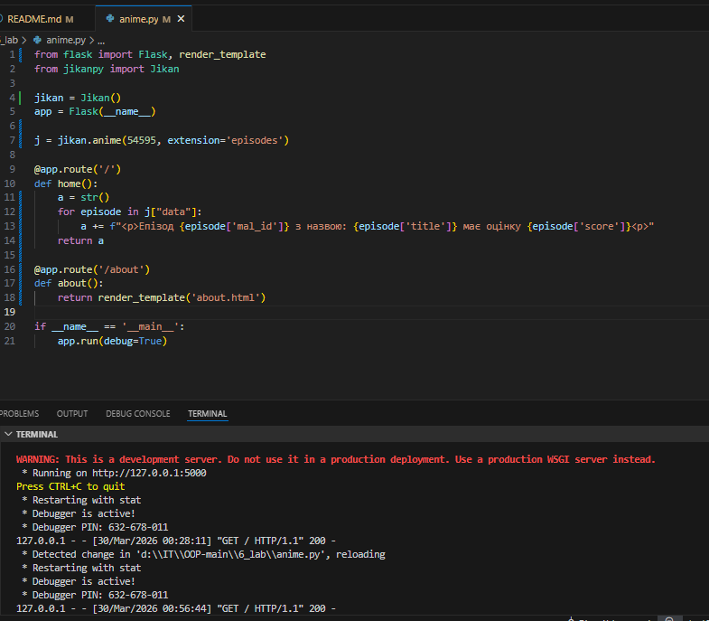
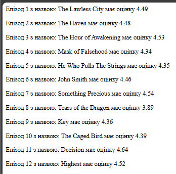
---

## Створення та активація venv
- Створено віртуальне середовище `my_env`.  
- Активовано середовище та перевірено бібліотеку `requests`.  
- 

## Використання менеджера пакетів pipenv
- Встановлено `pipenv`.
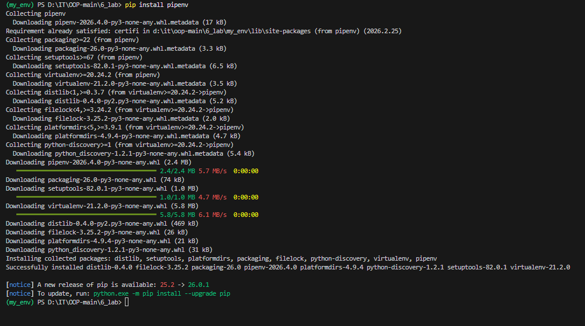
- Виконано команди:
pipenv graph
   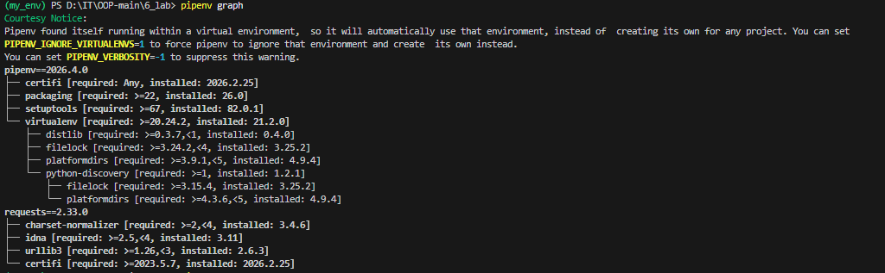
pipenv check --scan
   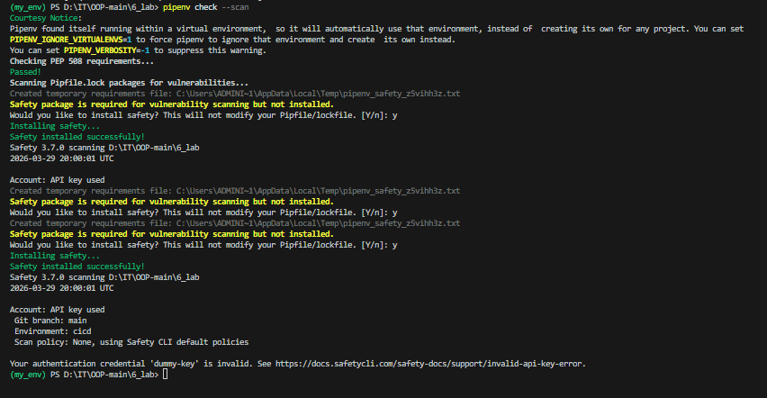

## Робота з сучасним інструментом Poetry
 - 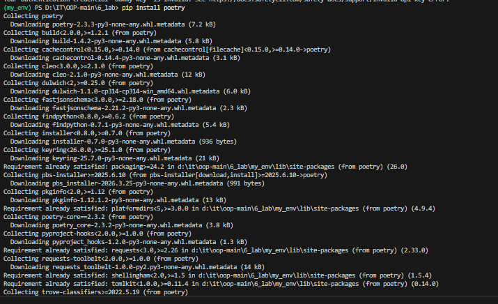
 - 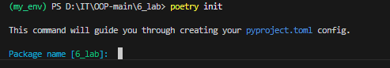
 - 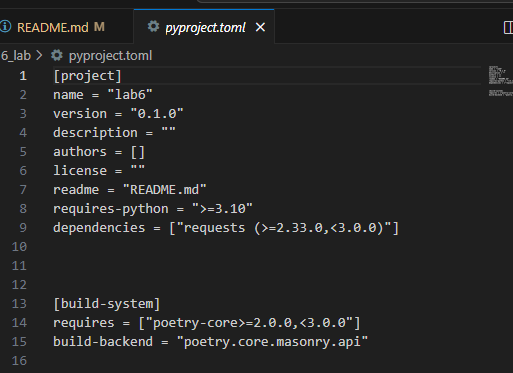
 - 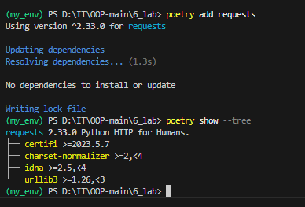

 - 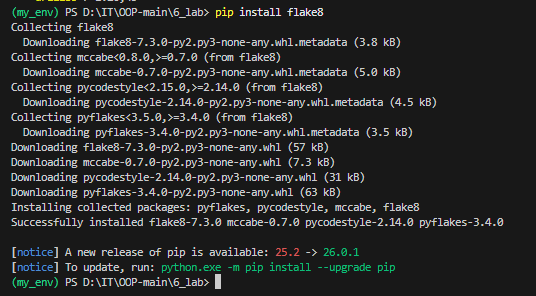
  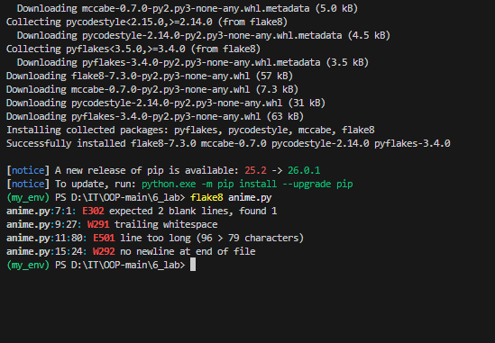

## Висновок

Під час виконання лабораторної роботи я закріпив навички роботи з віртуальними середовищами Python та менеджерами залежностей. Було створено та протестовано середовища трьома способами: за допомогою **venv**, **pipenv** та **poetry**, що дозволило переконатися у їхній повній ізоляції від глобальних пакетів системи.  

Я навчився встановлювати та керувати сторонніми бібліотеками (наприклад, `requests`), а також перевіряти їхні залежності та сумісність. Додатково було проведено аналіз коду за допомогою **flake8**, який виявив стильові помилки та показав важливість дотримання стандартів PEP8 для підтримки чистоти та зрозумілості коду.  

Головним результатом стало успішне налаштування інструментів для керування залежностями та середовищами, що підтверджує їхню необхідність у сучасних Python‑проєктах для уникнення конфліктів версій та забезпечення стабільності розробки.
