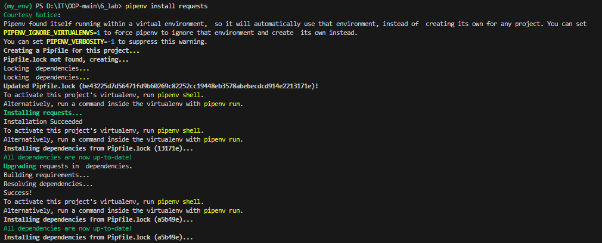

# Лабораторна робота №6  
**Тема:** Робота з віртуальними середовищами.

**Мета роботи:**
Ознайомитися з інструментами управління пакетами в Python (pip), навчитися створювати ізольовані віртуальні середовища за допомогою venv, pipenv та poetry, а також здобути практичні навички роботи зі сторонніми API за допомогою бібліотек requests, jikanpy та мікрофреймворку Flask.

# Хід роботи

## Крок 1. Основи роботи з сторонніми бібліотеками 
-
-
-
---

## Крок 2. Структура проєкту
- Створено папку `6_lab` з файлами: `anime.py`, `README.md`, зображеннями та середовищем `my_env`.  
- 

---

## Крок 4. Код `anime.py`
- Написано Python-скрипт `anime.py`.  
- 

---

## Крок 5. Перегляд `.gitignore` у VS Code
- Відкрито `.gitignore` у редакторі.  
- 

---

## Крок 6. Створення та активація venv
- Створено віртуальне середовище `my_env`.  
- Активовано середовище та перевірено бібліотеку `requests`.  
- 

---

## Крок 7. Pipenv
- Встановлено `pipenv`.  
- Виконано команди:
  ```powershell
  pipenv install requests
  pipenv graph
  pipenv check --scan
